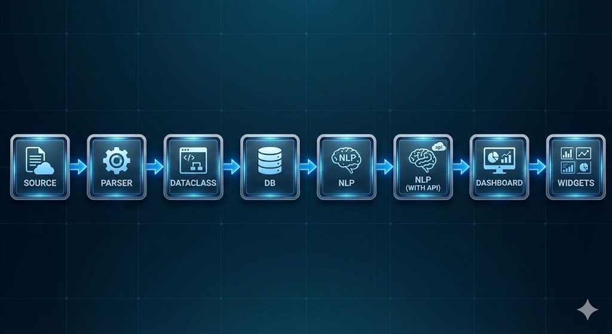

# Restaurant Analytics Dashboard

A natural language dashboard generator for restaurant analytics that consolidates data from multiple POS systems (Toast, DoorDash, Square) and transforms it into actionable insights powered by AI.




## Table of Contents

- [Overview](#overview)
- [Setup/Installation](#setupinstallation)
- [Data Cleaning & Normalization](#data-cleaning--normalization)
- [Database Schema Design](#database-schema-design)
- [AI Query Parsing & Visualization](#ai-query-parsing--visualization)
- [Assumptions, Tradeoffs & Design Decisions](#assumptions-tradeoffs--design-decisions)
- [Future Improvements](#future-improvements)

---

## Overview

This project provides a web application where restaurant owners can type natural language queries like:
- "Show me sales comparison between Downtown and Airport locations"
- "What were my top 5 selling products last week?"

The system dynamically generates appropriate visualizations based on these queries.

**Architecture:**
- **Backend:** FastAPI (Python) with Supabase as the database
- **Frontend:** React + TypeScript + Vite with Recharts for visualizations
- **AI:** OpenAI GPT-4o-mini for natural language query parsing
- **Database:** Supabase (PostgreSQL)

---

## Setup/Installation

### Prerequisites

- Python 3.8+ 
- Node.js 18+ and npm/yarn
- Supabase account (free tier works)
- OpenAI API key

### Backend Setup

1. **Clone the repository:**
   ```bash
   git clone
   cd clave-take-home
   ```

2. **Install Python dependencies:**
   ```bash
   pip install -r requirements.txt
   ```

3. **Set up Supabase:**
   - Create a new project at [supabase.com](https://supabase.com)
   - Get your project URL and service role key from Settings > API
   - Create the database schema (see [Database Schema Design](#database-schema-design) section below)
   - The schema includes these tables:
     - `locations`, `addresses`, `categories`, `items`, `item_variations`
     - `item_location_mapping`, `orders`, `order_details`
     - `fulfillments`, `payments`, `card_details`, `cash_details`

4. **Create `.env` file in the root directory:**
   ```env
   OPENAI_API_KEY=your_openai_api_key_here
   SUPABASE_URL=https://your-project.supabase.co
   SUPABASE_SERVICE_ROLE_KEY=your_service_role_key_here
   ```

5. **Load data into Supabase:**
   ```bash
   # Load Square data
   # Edit src/db/test.py and set LOAD_SQUARE = True
   python src/db/test.py
   
   # Load DoorDash data
   # Edit src/db/test.py and set LOAD_SQUARE = False
   python src/db/test.py
   ```

6. **Clean and normalize product names:**
   ```bash
   # This uses fuzzy matching + GPT to standardize item names
   python src/cleaner/clean_names.py
   ```

7. **Start the backend server:**
   ```bash
   uvicorn src.api.main:app --reload --port 8001 
   ```
   The API will be available at `http://localhost:8001`

### Frontend Setup

1. **Navigate to frontend directory:**
   ```bash
   cd frontend
   ```

2. **Install dependencies:**
   ```bash
   npm install
   ```

3. **Create `.env` file in the frontend directory:**
   ```env
   VITE_API_BASE_URL=http://localhost:8001
   ```

4. **Start the development server:**
   ```bash
   npm run dev
   ```
   The frontend will be available at `http://localhost:8080` (or the port shown in terminal)

### Verifying Setup

- Backend API docs: `http://localhost:8001/docs` (FastAPI Swagger UI)
- Frontend: Open `http://localhost:51808` in your browser
- Verify set up by seeing dahsboard


---

## Data Cleaning & Normalization

### Data Sources

The project processes data from two different POS systems with varying schemas:

1. **Square POS** (`square/` folder)
   - Split across 4 files (simulating real API structure):
     - `catalog.json` - Items, variations, categories, modifiers
     - `orders.json` - Orders with line_items (reference catalog by ID)
     - `payments.json` - Payments (reference orders by ID)
     - `locations.json` - Location details

2. **DoorDash** (`doordash_orders.json`)
   - Single JSON file with flat order structure
   - Delivery fees, commissions, and tips at order level
   - `order_items[]` array for line items

### Normalization Challenges

The data contains real-world inconsistencies:

| Issue | Examples |
|-------|----------|
| **Typos** | "Griled Chiken", "expresso", "coffe", "Appitizers" |
| **Inconsistent naming** | "Hash Browns" vs "Hashbrowns" vs "Hashbrowns" |
| **Categories** | "🍔 Burgers" vs "Burgers" vs "BURGERS" |
| **Baked-in variations** | "Churros 12pcs" vs "Churros" + variation "12 piece" |
| **Format differences** | "Lg Coke" vs "Large Coca-Cola" vs "fountain soda" |

### Cleaning Approach

The normalization process consists of multiple stages:

#### 1. **Parser Layer** (`src/parser/`)
- **Square Parser** (`square_parser.py`): Parses 4 separate JSON files, handles emoji removal, converts cents to dollars
- **DoorDash Parser** (`doordash_parser.py`): Parses single JSON file, handles delivery-specific fields

All parsers map to unified dataclasses in `src/dataclasses/` ensuring consistent structure regardless of source.

#### 2. **Data Cleaning Pipeline** (`src/cleaner/`)

**Fuzzy Matching** (`fuzzy_grouper.py`):
- Uses `rapidfuzz` library to find similar names
- Groups items within categories using threshold-based matching (default: 75% similarity)
- Groups variations within items

**GPT-Based Cleaning** (`gpt_cleaner.py`):
- Sends grouped similar names to OpenAI GPT-4o-mini
- GPT suggests standardized `display_name` values
- Handles:
  - Typos correction
  - Case normalization
  - Emoji/styling removal
  - Variation standardization

**Database Updates** (`clean_names.py`):
- Interactive script that shows preview before updating
- Updates only `display_name` field (preserves original `name` for audit)
- Idempotent: only processes records where `display_name IS NULL`
- Requires user confirmation before applying changes

#### 3. **Normalization Principles**

- **Preserve Original Data**: Always keep original `name` field, clean data goes into `display_name`
- **Category-Based Grouping**: Items are grouped by `category_id` before fuzzy matching
- **Item-Based Grouping**: Variations are grouped by `item_id` before cleaning
- **Transactional Safety**: All database inserts use transaction wrapper with rollback capability

#### 4. **Location Mapping**

All sources represent the same 4 locations with different IDs:

| Location Name | DoorDash Store ID | Square Location ID |
|--------------|------------|-------------------|-------------------|
| Downtown| `str_downtown_001` | `LCN001DOWNTOWN` |
| Airport | `str_airport_002` | `LCN002AIRPORT` |
| Mall Location| `str_mall_003` | `LCN003MALL` |
| University| `str_university_004` | `LCN004UNIV` |

These are normalized to a single `locations` table with consistent naming.

---

## Database Schema Design

### Schema Overview

The database uses a star schema design optimized for restaurant analytics queries:

**Dimension Tables:**
- `locations` - Restaurant locations
- `addresses` - Address information for locations
- `categories` - Product categories
- `items` - Menu items/products
- `item_variations` - Variations of items (sizes, options)
- `item_location_mapping` - Many-to-many: which items available at which locations

**Fact Tables:**
- `orders` - Order records (grain: one row per order)
- `order_details` - Line items in orders (grain: one row per item in order)
- `fulfillments` - Fulfillment method per order (DINE_IN, PICKUP, DELIVERY)
- `payments` - Payment records (grain: one row per payment)
- `card_details` - Credit card payment details
- `cash_details` - Cash payment details

### Table Details

```sql
-- Core dimension tables
locations (id, name, timezone, status, type, merchant_id, created_at, updated_at)
addresses (id, location_id, address_line_1, locality, postal_code, country, ...)
categories (id, name, display_name, created_at, updated_at)
items (id, name, description, display_name, category_id, ...)
item_variations (id, item_id, name, price, price_currency, display_name, ...)

-- Fact tables
orders (id, location_id, ref_id, source, created_at, closed_at, 
        tip_amount, tax_amount, total_money, total_money_currency, ...)
order_details (id, order_id, itemvar_id, qty, gross_amount, total_amount, ...)
fulfillments (id, order_id, type, state, ...)
payments (id, order_id, location_id, amount, source_type, status, ...)
card_details (id, payment_id, card_brand, last_4, ...)
cash_details (id, payment_id, buyer_supplied_money, change_back_money, ...)
```

### Design Decisions

1. **Star Schema**: Fact tables store measurable events (orders, payments), dimension tables store descriptive attributes (locations, products). This design optimizes for analytical queries.

2. **Normalized vs Denormalized**:
   - Dimensions are normalized (locations, categories separate from items)
   - Facts reference dimensions via foreign keys
   - Tradeoff: More joins required, but better data integrity and easier updates

3. **Source Tracking**: Each order has a `source` field (`SQUARE`, `DOORDASH`) and `ref_id` to track original system IDs for debugging.

4. **Display Names**: Both `items` and `item_variations` have `name` (original) and `display_name` (cleaned) fields. Queries use `display_name` for grouping/aggregation to ensure consistency.

5. **Currency Handling**: All monetary fields include both amount and currency code. Currently assumes USD but schema supports multi-currency.

6. **Fulfillment Type**: Stored in separate `fulfillments` table rather than on orders directly, allowing multiple fulfillment methods per order (though current data has one per order).

### Schema Definition

The schema is programmatically defined in `src/query/schema.py` which:
- Provides metadata to the LLM for query generation
- Validates table/column names in queries
- Documents relationships between tables

---

## AI Query Parsing & Visualization

### Architecture

The natural language query flow with guardrails:

```
User Query → LLM Parser → Structured JSON → API Router → [API Endpoint (Guardrails) | Query Builder (Fallback)] → Results → Formatter → Frontend
```

**Key Design**: The system prioritizes trusted API endpoints over direct database queries to prevent LLM-generated incorrect queries. If a query can be matched to a predefined API endpoint, it uses that instead of executing a potentially incorrect database query.

### 1. LLM Query Parser (`src/query/llm_parser.py`)

**Model:** OpenAI GPT-4o-mini (default), temperature = 0 (deterministic)

**Process:**
1. Takes natural language query from user
2. Builds prompt with:
   - Database schema summary
   - Query format specification
   - Example queries
   - Visualization type rules
3. Returns structured JSON query object

**Structured Query Format:**
```json
{
  "intent": "sales_comparison_by_location",
  "tables": ["orders", "locations"],
  "select": ["locations.name", "SUM(orders.total_money) AS total_sales"],
  "aggregations": ["SUM"],
  "joins": [{
    "type": "inner",
    "table": "locations",
    "on": "orders.location_id = locations.id"
  }],
  "filters": {
    "locations.name": {
      "operator": "in",
      "value": ["Downtown", "Airport"]
    }
  },
  "group_by": ["locations.id", "locations.name"],
  "order_by": {"column": "total_sales", "direction": "desc"},
  "limit": null,
  "visualization": {
    "type": "bar_chart",
    "x_axis": "locations.name",
    "y_axis": "total_sales"
  }
}
```

**Key Prompt Instructions:**
- Use `display_name` for items/variations (not `name`)
- For "sales" queries: clarify revenue (`total_money`) vs count (`COUNT(orders)`)
- Location names: Downtown, Airport, Mall Location, University
- Follow visualization type rules (bar for comparisons, line for trends, etc.)

### 2. API Router (`src/query/api_router.py`) - Guardrails System

**Purpose**: Acts as a safety layer by routing structured queries to trusted, predefined API endpoints instead of directly executing LLM-generated database queries. This prevents incorrect/hallucinated queries from the LLM.

**How It Works:**
1. After LLM parses the query to structured JSON, the API Router analyzes the intent and structure
2. Attempts to match the query to one of 12 predefined API endpoints
3. If matched, routes to the trusted API endpoint with extracted parameters
4. If no match, falls back to QueryBuilder for direct database execution

**Supported API Endpoints (12 total):**

**Metrics APIs:**
- `get_revenue_by_location()` - Revenue aggregated by location
- `get_revenue_trend()` - Revenue trends over time (hourly/daily)
- `get_revenue()` - Simple revenue query with optional location filter

**Products APIs:**
- `get_top_selling_products()` - Top N products by revenue or quantity

**Locations APIs:**
- `compare_locations()` - Compare revenue/orders across specific locations
- `get_location_performance()` - Location ranking and performance metrics

**Orders APIs:**
- `get_fulfillment_breakdown()` - Dine-in vs delivery vs pickup analysis
- `get_average_order_value()` - Average order value calculation

**Payments APIs:**
- `get_payment_method_breakdown()` - Card vs cash vs other payment methods
- `get_tips_analysis()` - Tips analysis and statistics

**Time Analysis APIs:**
- `get_peak_hours()` - Peak ordering hours analysis
- `get_day_of_week_analysis()` - Day of week patterns

**Routing Logic:**
- Matches based on `intent`, `tables`, `filters`, and `group_by` fields from structured query
- Extracts parameters (dates, locations, limits) from filters automatically
- Handles common query patterns like "revenue by location", "top products", "peak hours", etc.

**Benefits:**
- **Reliability**: Trusted API endpoints are tested and validated
- **Performance**: Optimized queries in service layer
- **Safety**: Prevents incorrect SQL generation from LLM
- **Maintainability**: Changes to business logic only need updates in one place

### 3. API Executor (`src/query/api_executor.py`)

Executes the matched API endpoint and transforms the response:
- Calls the API service function with extracted parameters
- Formats the response using DataFormatter (which can use LLM for additional filtering)
- Transforms to unified response format expected by frontend
- Handles errors gracefully with fallback to empty results

### 4. Query Builder (`src/query/query_builder.py`) - Fallback

1. **Query Execution**: Fetch data using Supabase query builder
2. **Post-Processing**: Apply aggregations (SUM, COUNT, AVG) in Python
3. **Grouping**: Group by specified columns in memory
4. **Join Handling**: Use Supabase foreign table syntax (`*, foreign_table(*)`) where possible

**Aggregation Logic:**
- Detects aggregation functions in `select` fields
- Groups data by `group_by` columns
- Applies aggregations per group
- Handles nested data from joins

### 5. Visualization Selection

**Automatic Selection Rules:**
- **Bar Chart**: Comparisons, rankings, categories (e.g., revenue by location, top products)
- **Line Chart**: Trends over time (e.g., hourly sales, daily revenue)
- **Pie Chart**: Part-to-whole relationships (e.g., payment methods, fulfillment types)
- **Table**: Detailed data, multiple columns, lists
- **Metric Card**: Single number/value (e.g., total revenue, average order value)
- **Text**: Simple questions needing text response

The LLM suggests visualization type, but `QueryBuilder._determine_visualization()` can override based on data characteristics.

### 6. Data Formatter (`src/query/data_formatter.py`)

Formats query results for frontend consumption:
- Extracts x/y axis columns
- Formats dates/timestamps
- Handles nested data from joins
- Prepares summary statistics
- Can use LLM for additional filtering/transformation when needed

### 7. Frontend Visualization (`frontend/src/components/dashboard/`)

**Components:**
- `QueryVisualization.tsx` - Main component that renders charts based on metadata
- Chart components in `charts/`:
  - `RevenueByLocationChart.tsx` - Bar chart for location comparisons
  - `RevenueTrendChart.tsx` - Line chart for time trends
  - `TopSellingChart.tsx` - Horizontal bar for rankings
  - `PaymentMethodsChart.tsx` - Pie chart for payment types
  - `PeakHoursChart.tsx` - Line chart for hourly patterns
  - `FulfillmentChart.tsx` - Pie/bar for fulfillment types

**Library:** Recharts (React charts library built on D3)

**State Management:** React hooks with context for date range filtering

---

## Assumptions, Tradeoffs & Design Decisions

### Assumptions

1. **Data Scope**: All data covers January 1-4, 2025 only. Time-based queries are limited to this range.

2. **Currency**: All amounts are USD. Multi-currency support exists in schema but not fully implemented.

3. **Location Mapping**: Location names are known and hardcoded in prompts (Downtown, Airport, Mall Location, University).

4. **Query Complexity**: Focused on common analytics queries. Complex SQL features (window functions, CTEs) not supported via Supabase API.

5. **Display Names**: Users querying products should use `display_name` (cleaned) rather than original `name` for accurate grouping.

### Tradeoffs

#### 1. **Supabase vs Raw SQL**
- **Chose**: Supabase PostgREST API
- **Pros**: Managed infrastructure, easy setup, auto-generated API, RLS support
- **Cons**: Limited SQL features, aggregations must be done in Python, more complex joins
- **Alternative**: Direct PostgreSQL connection with SQL execution would allow full SQL but loses Supabase features

#### 2. **In-Memory Aggregations**
- **Chose**: Fetch all data, aggregate in Python
- **Pros**: Works with Supabase limitations, flexible post-processing
- **Cons**: Not scalable for large datasets, slower than database aggregations
- **Mitigation**: For production, would add pagination, date range limits, or move to database functions

#### 3. **LLM Query Parsing with API Router Guardrails**
- **Chose**: GPT-4o-mini with structured JSON output + API Router guardrails
- **Pros**: 
  - Handles natural language well, flexible for new query types
  - API Router provides safety layer preventing incorrect queries
  - Trusted endpoints ensure reliable results for common queries
- **Cons**: Requires API key, cost per query, fallback queries still at risk
- **Mitigation**: API Router catches most common queries, only complex/unusual queries fall back to direct execution
- **Alternative**: Rule-based parser would be faster/cheaper but less flexible

#### 4. **Data Cleaning Strategy**
- **Chose**: Fuzzy matching + GPT cleaning with user confirmation
- **Pros**: Handles real-world messiness, preserves original data
- **Cons**: Manual confirmation step, requires GPT API for cleaning
- **Alternative**: Rule-based cleaning would be faster but less accurate

#### 5. **Schema Normalization**
- **Chose**: Normalized star schema
- **Pros**: Data integrity, easier updates, standard analytics pattern
- **Cons**: More joins required, slower queries
- **Alternative**: Denormalized tables would be faster but harder to maintain

#### 6. **Frontend Framework**
- **Chose**: React + Vite (not Next.js as suggested)
- **Pros**: Faster development, simpler setup, sufficient for dashboard
- **Cons**: Missing SSR benefits, separate backend needed
- **Note**: Assessment suggested Next.js but current implementation uses React + FastAPI backend

### Design Decisions

1. **Separate Backend**: FastAPI backend separate from frontend allows:
   - Independent scaling
   - Easy API documentation (Swagger)
   - Multiple frontend clients (web, mobile)

2. **Transaction Wrapper**: Custom transaction wrapper (`src/db/transaction.py`) tracks inserts and provides rollback since Supabase doesn't support traditional transactions via API.

3. **Singleton DB Connection**: Database connection uses singleton pattern (`src/db/dbConnect.py`) to ensure single Supabase client instance.

4. **Service Layer**: Business logic separated into services (`src/api/services/`) rather than in routes, improving testability and reusability.

5. **Dataclasses**: All parsed data mapped to Python dataclasses (`src/dataclasses/`) ensuring type safety and consistent structure.

6. **Error Handling**: Comprehensive error handling with meaningful messages, fallback visualizations, and user-friendly error states.

---

## Future Improvements

Given more time, here are the improvements I would prioritize:

### 1. **Performance Optimizations**
- **Database Optimization**: Materialized views, pagination
- **Caching**: Add Redis cache for frequent queries (e.g., "total revenue today")
- **Query Optimization**: Add indexes on frequently queried columns (`created_at`, `location_id`, `itemvar_id`)

### 2. **Enhanced AI Query Parsing**
Create two different agents- one for intent one for sql

### 3. **Data Quality**
- **Automated Cleaning**: Schedule automated name cleaning jobs
- **Validation Rules**: Add data validation rules (e.g., orders must have items)
- **Data Profiling**: Dashboard showing data quality metrics
- **Anomaly Detection**: Flag unusual patterns in data

### 4. **Visualization Enhancements**
- **Interactive Charts**: Add drill-down, filtering, zoom
- **Custom Chart Types**: Support more chart types (heatmaps, scatter plots, etc.)
- **Export**: Allow exporting charts as images/PDF
- **Saved Dashboards**: Save and share dashboard layouts
- **Real-time Updates**: Import Data from UI or Kafka

### 5. **User Experience**
- **Natural Language Improvements**: Better handling of ambiguous queries

### 6. **Architecture**
- Group by client

### 7. **Data Sources**
- Support for Toast

### 8. **Advanced Analytics**
- Agents that could analyse and recommend APIs to be created.


---

## Project Structure

```
clave-take-home/
├── data/
│   └── sources/           # Raw JSON data files
├── docs/                  # Documentation
├── frontend/              # React frontend
│   ├── src/
│   │   ├── components/   # React components
│   │   ├── config/       # API configuration
│   │   └── pages/        # Page components
│   └── package.json
├── src/
│   ├── api/              # FastAPI application
│   │   ├── routes/       # API endpoints
│   │   └── services/     # Business logic
│   ├── cleaner/          # Data cleaning scripts
│   ├── dataclasses/      # Data models
│   ├── db/               # Database operations
│   ├── parser/           # JSON parsers
│   └── query/            # AI query processing
├── requirements.txt      # Python dependencies
├── run_api.py           # API server entry point
└── README.md            # This file
```

---

## License

This project is one of the solutions of the take home assessment provided by CLAVE - done by Katyani Mehra.

---

## Contact

For questions or issues, please contact:
- katyani.mehra.dev@gmail.com

